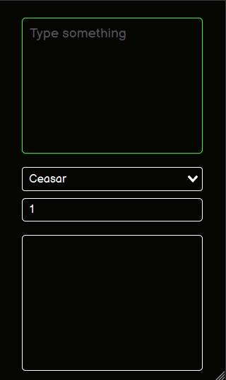
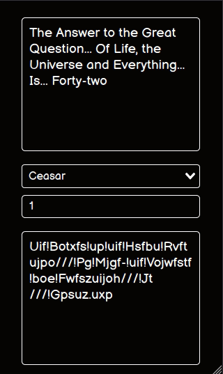
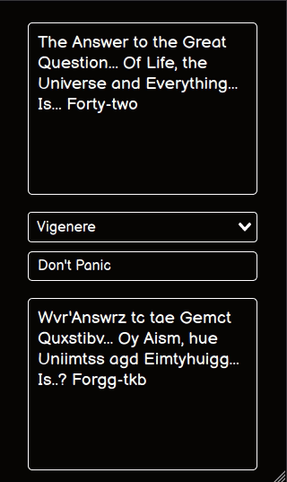

# Ciphers

[**Ceasar Cipher**](https://en.wikipedia.org/wiki/Caesar_cipher)

[**Vigenere Cipher**](https://en.wikipedia.org/wiki/Vigen%C3%A8re_cipher)

[**Vernam Cipher**](https://en.wikipedia.org/wiki/One-time_pad)

## Table of Contents

1. [Run](#run)
2. [Examples](#examples)

## Run

```bash
npm run serve
```

## Examples

1. Ceasar



2. Vigenere



3. Vernam


