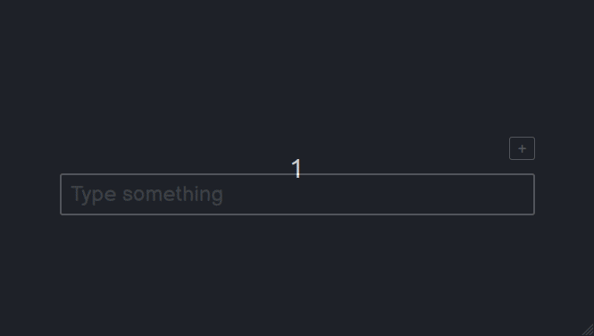
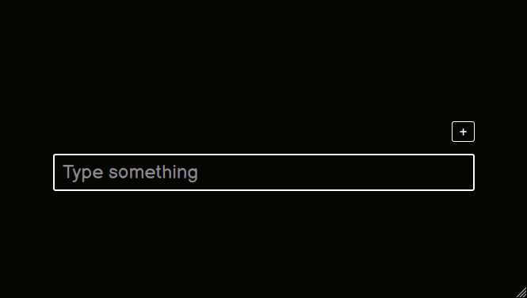

# Inverted Index

[**Inverted Index**](https://en.wikipedia.org/wiki/Inverted_index)

## Table of Contents

1. [Client](#client)
   - [Config](#client-config)
   - [Build](#client-build)
   - [Run](#client-run)
2. [Server](#server)
   - [Config](#server-config)
   - [Build](#server-build)
   - [Run](#server-run)
3. [Examples](#examples)

## Client

### <a name="client-config"></a> Config

For configure client you need to create _.env_ file

```bash
SERVER_ADDRESS=127.0.0.1:3000
API_ROUTE=api
```

### <a name="client-build"></a> Build

```bash
npm install
npm run build
```

This commands will create _dist_ folder with build output

### <a name="client-run"></a> Run

**Development mode**

```bash
npm start
```

**Production mode**

```bash
node dist/app.js
```

> Make sure you build client before run in production mode

## Server

Server also serves _client/dist_ folder

### <a name="server-config"></a> Config

For configure server you need to create _.env_ file

```bash
HOSTNAME=127.0.0.1
PORT=3000
SOCKET_PORT=5031
SOCKET_PATH=/api/search
MONGO_DB_CONN_STR=mongodb://127.0.0.1/files
```

### <a name="server-build"></a> Build

```bash
npm install
npm run build
```

The resulting output will be in _dist_ folder

### <a name="server-run"></a> Run

**Development mode**

```bash
npm start
```

**Production mode**

```bash
node dist/app.js
```

> Make sure you build server before run in production mode

## Examples

1. Upload file


2. Search



3. Download File


