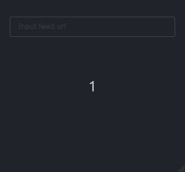

# RSS Reader

[**RSS**](https://en.wikipedia.org/wiki/RSS)

## Table of Contents

1. [Run](#run)
2. [Example](#example)

## Run

```bash
npm run build
node server.js
```

App will be available at localhost:8080

## Example


